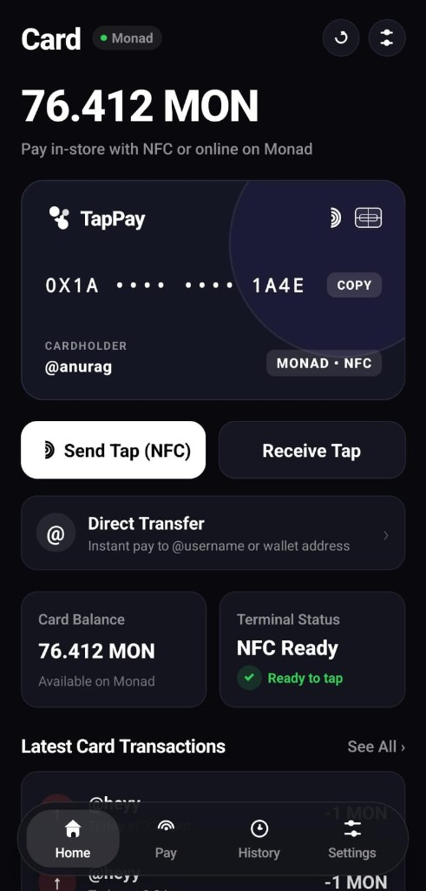
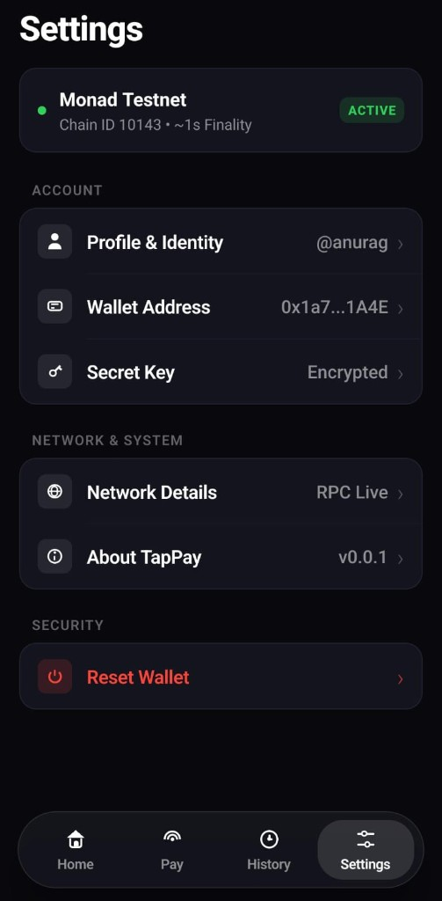
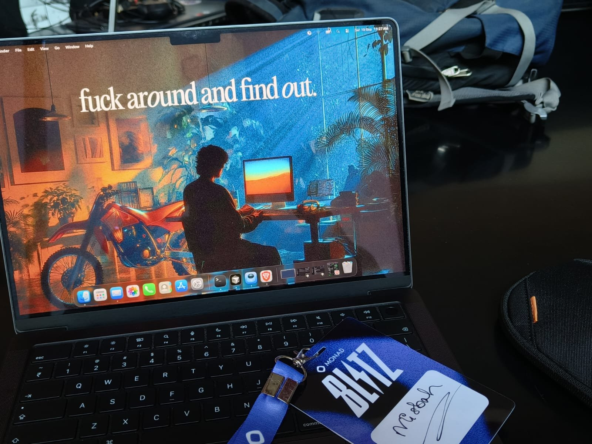
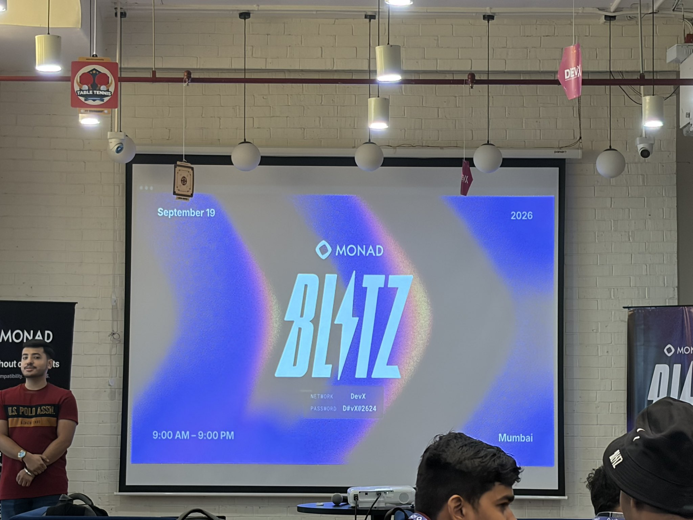

# TapPay

Phone-to-phone contactless payments on [Monad Testnet](https://docs.monad.xyz) — NFC tap or `@username` send, settled on-chain as native MON.

<p align="center">
  
  &nbsp;
  
</p>

<p align="center">
  <em>Home (Card) &nbsp;·&nbsp; Settings</em>
</p>

---

## Quick Links (for judges)

| | |
|:--|:--|
| **APK Download** | [Tap-pay.apk (Google Drive)](https://drive.google.com/file/d/1w3K3PTeqvt250qMJne4azXeU4D35dC8P/view?usp=drivesdk) |
| **Video Demo** | [tappay.mp4 (Google Drive)](https://drive.google.com/file/d/1f8ZO1ian1y1d4o98g1C-SuV6wPYAysDC/view?usp=sharing) |
| **UsernameRegistry** | [`0xEebB05F9AF06908eCb7bFa5F916Dde1EEa231aDD`](https://testnet.monadscan.com/address/0xEebB05F9AF06908eCb7bFa5F916Dde1EEa231aDD) |
| **TapPayLedger** | [`0x5B177FEF554dA84A86be62E45fb49BB52e6D6838`](https://testnet.monadscan.com/address/0x5B177FEF554dA84A86be62E45fb49BB52e6D6838) |

---

## What is TapPay?

TapPay is a React Native wallet built for **Monad Blitz** that settles payments as native MON on Monad Testnet (Chain ID `10143`).

**Two ways to pay**

1. **Tap Pay (NFC)** — sender reads the receiver’s address over NFC Host Card Emulation, then broadcasts `payWithLog` on TapPayLedger
2. **Username / Address Pay** — search `@username` (or paste a wallet address), enter amount on a Cash App–style keypad, confirm, and send

Keys stay on-device (Android Keystore via `react-native-keychain`). No custodial balances.

---

## Deployed Contracts (Monad Testnet)

**Network:** Monad Testnet · Chain ID `10143` · ~1s finality

| Contract | Address | Explorer |
|:---------|:--------|:---------|
| **UsernameRegistry** | `0xEebB05F9AF06908eCb7bFa5F916Dde1EEa231aDD` | [View on Monadscan](https://testnet.monadscan.com/address/0xEebB05F9AF06908eCb7bFa5F916Dde1EEa231aDD) |
| **TapPayLedger** | `0x5B177FEF554dA84A86be62E45fb49BB52e6D6838` | [View on Monadscan](https://testnet.monadscan.com/address/0x5B177FEF554dA84A86be62E45fb49BB52e6D6838) |

**Deployer:** [`0x1406Fe936D971A0dAE9a19DD3354b900B08Fa002`](https://testnet.monadscan.com/address/0x1406Fe936D971A0dAE9a19DD3354b900B08Fa002)

### TapPayLedger

Payment rail for NFC and direct sends. Sender calls `payWithLog(to, sessionIdHash)` with `msg.value`; funds forward atomically to the recipient and emit `PaymentLogged`.

- ReentrancyGuard + checks-effects-interactions
- Session-based replay protection
- Pausable / Ownable2Step
- Pass-through only — no custody

### UsernameRegistry

On-chain username ↔ address mapping used for human-readable pay and reverse lookup on receipts.

---

## Demo Assets

### APK

**APK URL:** [https://drive.google.com/file/d/1w3K3PTeqvt250qMJne4azXeU4D35dC8P/view?usp=drivesdk](https://drive.google.com/file/d/1w3K3PTeqvt250qMJne4azXeU4D35dC8P/view?usp=drivesdk)

Install on two NFC-capable Android phones to try Tap Pay end-to-end.

A debug APK is also available from GitHub Actions if needed:

1. Open [Actions → Build workflow](https://github.com/anuraggdubey/tappay/actions)
2. Open the latest successful run
3. Download the APK artifact

### Video Demo

**Video Demo URL:** [https://drive.google.com/file/d/1f8ZO1ian1y1d4o98g1C-SuV6wPYAysDC/view?usp=sharing](https://drive.google.com/file/d/1f8ZO1ian1y1d4o98g1C-SuV6wPYAysDC/view?usp=sharing)

---

## Social Posts

Live posts from **Monad India Blitz V4**, shown with the same media as on X and LinkedIn.

<table>
<tr>
<td width="50%" valign="top">

<p>

&nbsp;&nbsp;<strong>Misbah(agentic arc)</strong><br/>
<a href="https://x.com/Misbahtwts">@Misbahtwts</a>
</p>

> At @monad hack today.
>
> If you're here, come say hi.

<p align="center">
  <a href="https://x.com/Misbahtwts/status/2101171148813639993?s=20">
    
  </a>
</p>

<p><a href="https://x.com/Misbahtwts/status/2101171148813639993?s=20">View on X</a></p>

</td>
<td width="50%" valign="top">

<p>

&nbsp;&nbsp;<strong>Misbah(agentic arc)</strong><br/>
<a href="https://x.com/Misbahtwts">@Misbahtwts</a>
</p>

> We @anuraggdubeyy @AdityaNishad987 cooking now for monad hack.
>
> How does this wallpaper look btw?

<p align="center">
  <a href="https://x.com/Misbahtwts/status/2101196068054769999?s=20">
    
  </a>
</p>

<p><a href="https://x.com/Misbahtwts/status/2101196068054769999?s=20">View on X</a></p>

</td>
</tr>
<tr>
<td width="50%" valign="top">

<p>

&nbsp;&nbsp;<strong>Misbah(agentic arc)</strong><br/>
<a href="https://x.com/Misbahtwts">@Misbahtwts</a>
</p>

> Tappay....
>
> will be sharing more details about it sooon.
>
> @MonadIndia @geeky_kartikey

<p align="center">
  <a href="https://x.com/Misbahtwts/status/2101255579910230415?s=20">
    
  </a>
</p>

<p><a href="https://x.com/Misbahtwts/status/2101255579910230415?s=20">View on X</a></p>

</td>
<td width="50%" valign="top">

<p>

&nbsp;&nbsp;<strong>Anurag Dubey</strong><br/>
<a href="https://x.com/anuraggdubeyy">@anuraggdubeyy</a>
</p>

> Here at @MonadIndia Blitz V4.

<p align="center">
  <a href="https://x.com/anuraggdubeyy/status/2101171282012442744?s=20">
    
  </a>
</p>

<p><a href="https://x.com/anuraggdubeyy/status/2101171282012442744?s=20">View on X</a></p>

</td>
</tr>
<tr>
<td width="50%" valign="top">

<p>

&nbsp;&nbsp;<strong>0xAdityaa</strong><br/>
<a href="https://x.com/AdityaNishad987">@AdityaNishad987</a>
</p>

> At @monad Blitz V4..

<p align="center">
  <a href="https://x.com/AdityaNishad987/status/2101170921033883854?s=20">
    
  </a>
</p>

<p><a href="https://x.com/AdityaNishad987/status/2101170921033883854?s=20">View on X</a></p>

</td>
<td width="50%" valign="top">

<p>

&nbsp;&nbsp;<strong>Misbah Ansari</strong><br/>
<a href="https://www.linkedin.com/in/misbah-ansari-52657428a">LinkedIn</a>
</p>

> We Anurag Dubey Aditya Nishad cooking now at monad hack.
>
> Kartikey Garg

<p align="center">
  <a href="https://www.linkedin.com/posts/misbah-ansari-52657428a_we-anurag-dubey-aditya-nishad-cooking-now-activity-7506962375024168960-KQwP">
    
  </a>
</p>

<p><a href="https://www.linkedin.com/posts/misbah-ansari-52657428a_we-anurag-dubey-aditya-nishad-cooking-now-activity-7506962375024168960-KQwP">View on LinkedIn</a></p>

</td>
</tr>
</table>

---

## Tech Stack

| Layer | Technology |
|:------|:-----------|
| Mobile | React Native 0.87 (bare), TypeScript |
| NFC / HCE | `react-native-hce`, Android `HostApduService` |
| NFC Reader | `react-native-nfc-manager` |
| Wallet | `ethers.js` v6 + Android Keystore (`react-native-keychain`) |
| Chain | Monad Testnet (`10143`) |
| Contracts | `UsernameRegistry.sol`, `TapPayLedger.sol` (Hardhat) |
| Identity cache | Supabase username index (with on-chain registry) |
| CI | GitHub Actions → debug APK artifact |

---

## Monad Testnet Config

| Setting | Value |
|:--------|:------|
| Chain ID | `10143` |
| RPC (primary) | `https://testnet-rpc.monad.xyz` |
| RPC (fallback) | `https://rpc.ankr.com/monad_testnet` |
| Explorer | `https://testnet.monadscan.com` |
| Faucet | `https://faucet.monad.xyz` |
| Currency | MON (18 decimals) |

Configured in [`src/config/monad.ts`](./src/config/monad.ts).

---

## Prerequisites

See [`requirement.txt`](./requirement.txt) for the full list.

- Node.js >= 18 (20 LTS recommended)
- JDK 17
- Android SDK (API 34 + Build-Tools 34)
- **Two physical Android devices with NFC** for Tap Pay (emulators cannot do HCE)

```bash
# macOS / Linux
export JAVA_HOME=$(/usr/libexec/java_home -v 17)
export ANDROID_HOME=$HOME/Android/Sdk
```

---

## Quick Start

```bash
git clone https://github.com/anuraggdubey/tappay.git
cd tappay
npm install

npm start
# separate terminal
npx react-native run-android
```

---

## Project Structure

```
TapPay/
├── android/                    # Native Android + HCE service
├── contracts/                  # TapPayLedger + UsernameRegistry
├── scripts/                    # Hardhat deploy
├── src/
│   ├── config/monad.ts         # RPC, chain, contract addresses
│   ├── services/               # wallet, NFC, HCE, registry, history
│   ├── screens/                # Home, Send/Receive Tap, Send Payment, Status…
│   ├── components/             # UI (radar, waiting card, modals…)
│   └── navigation/             # Stack + tabs
├── docs/screenshots/           # README UI shots
├── test/                       # Contract tests
└── .github/workflows/          # APK CI
```

---

## NFC Testing

NFC Host Card Emulation needs **two physical Android phones**. Emulators cannot test phone-to-phone tap.

1. Install the APK on both devices and enable NFC
2. **Receiver:** open Receive Tap (broadcasts wallet address over HCE)
3. **Sender:** enter amount → Ready to tap → hold phones together
4. Sender reads address, signs, and broadcasts on TapPayLedger
5. Both sides show a Glow-style Sent / Received receipt; balance updates in ~1–2s

---

## Documentation

- [`TapPay-Technical-Spec.md`](./TapPay-Technical-Spec.md) — architecture
- [`TapPay-Implementation-Plan.md`](./TapPay-Implementation-Plan.md) — implementation plan
- [`requirement.txt`](./requirement.txt) — contributor setup

---

## Team

Built at **Monad India Blitz V4** by:

- [Misbah](https://x.com/Misbahtwts)
- [Anurag Dubey](https://x.com/anuraggdubeyy)
- [Aditya](https://x.com/AdityaNishad987)

---

## License

MIT
