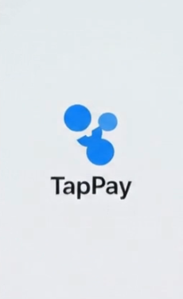
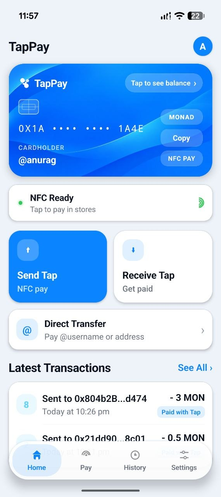
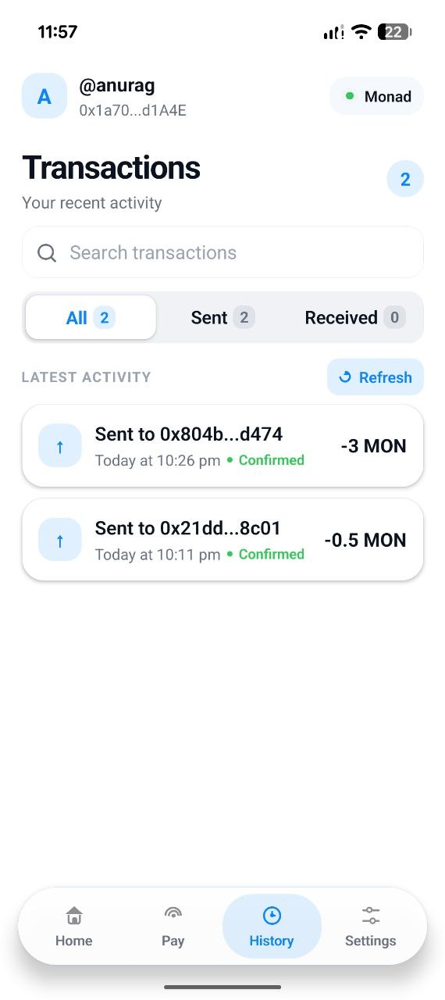
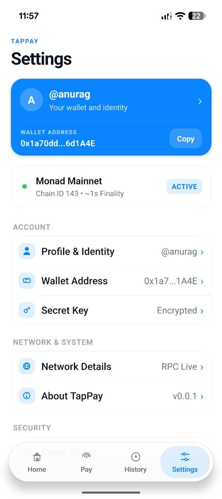
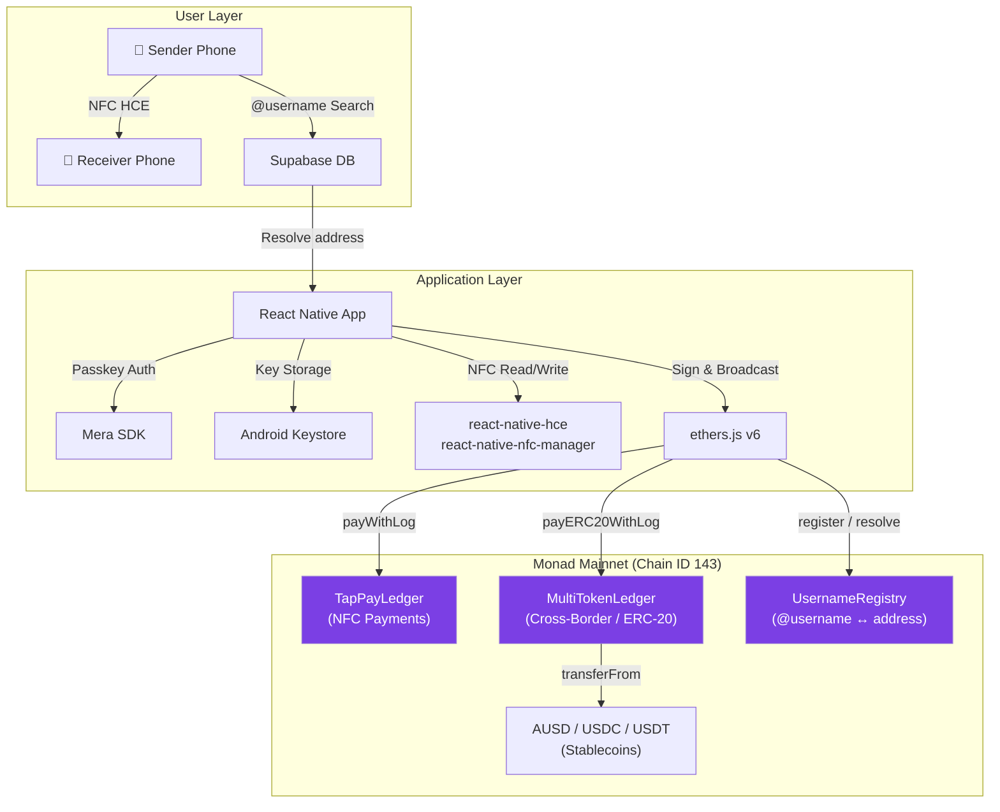

<p align="center">
  
</p>

<h1 align="center">TapPay</h1>

<p align="center">
  <strong>Phone-to-phone contactless payments on Monad — NFC tap or <code>@username</code> send, settled on-chain in ~1 second.</strong>
</p>

<p align="center">
  <a href="https://monadscan.com/address/0x03907aE845E016f5F1605BAE4e6392C3491e03f1">
    
  </a>
  <a href="https://drive.google.com/file/d/1w3K3PTeqvt250qMJne4azXeU4D35dC8P/view?usp=drivesdk">
    
  </a>
  <a href="https://drive.google.com/file/d/1f8ZO1ian1y1d4o98g1C-SuV6wPYAysDC/view?usp=sharing">
    
  </a>
  <a href="https://x.com/tapxpay">
    
  </a>
</p>

<p align="center">
  
  
  
  
  
</p>

---

## 📋 Table of Contents

- [The Problem](#-the-problem)
- [The Solution](#-the-solution)
- [App Screenshots](#-app-screenshots)
- [How It Works](#-how-it-works)
- [Architecture](#-architecture)
- [Sponsor Bounty: Agora — Cross-Border Payments](#-sponsor-bounty-agora--cross-border-payments)
- [Deployed Contracts (Monad Mainnet)](#-deployed-contracts-monad-mainnet)
- [Tech Stack](#-tech-stack)
- [Quick Start](#-quick-start)
- [Project Structure](#-project-structure)
- [NFC Testing Guide](#-nfc-testing-guide)
- [Documentation](#-documentation)
- [Team](#-team)

---

## 🔴 The Problem

Cross-border payments are **slow**, **expensive**, and **complex**. Traditional solutions (SWIFT, Western Union) take days and charge 5–10% in fees. Crypto wallets, while faster, require users to manage hex addresses, seed phrases, and gas — creating a UX nightmare for everyday users.

**There is no "Apple Pay for crypto."** No one has built a payment experience where you can physically tap phones together and settle a stablecoin transaction in under a second, with zero seed phrases.

---

## 💡 The Solution

**TapPay** is a non-custodial mobile wallet that makes on-chain payments feel as effortless as tapping a contactless card. Built on **Monad Mainnet** (Chain ID `143`), it harnesses ~1-second finality to deliver instant settlement across two intuitive payment modes:

| Mode | How It Works |
|:-----|:-------------|
| **📱 Tap Pay (NFC)** | Hold two phones together. The sender's address is read over NFC Host Card Emulation, the transaction is signed on-device, and payment settles on-chain — all in one tap. |
| **👤 Username Pay** | Search `@username`, enter an amount on a Cash App–style keypad, confirm, and send — no wallet addresses needed. |

**Key differentiators:**
- 🔐 **No seed phrases** — Passkey onboarding via Mera (Face ID / Fingerprint)
- 🏦 **Non-custodial** — Keys stay on-device (Android Keystore via `react-native-keychain`)
- 🌍 **Cross-border** — Send AUSD, USDC, USDT stablecoins to anyone with a `@username`
- ⚡ **Instant** — ~1s Monad finality means payment confirms before the UI animation ends

---

## 📸 App Screenshots

<p align="center">
  
  &nbsp;
  
</p>

<p align="center">
  
  &nbsp;
  
</p>

<p align="center">
  <em>Home&nbsp;&nbsp;·&nbsp;&nbsp;Pay&nbsp;&nbsp;·&nbsp;&nbsp;History&nbsp;&nbsp;·&nbsp;&nbsp;Settings</em>
</p>

<p align="center">
  <strong>Product demo</strong> — <a href="docs/screenshots/social/watermark-removed.mp4">watch the NFC tap film</a> (also on the <a href="https://github.com/anuraggdubey/Tap-Pay">project site</a> at <code>/#watch-demo</code>).
</p>

---

## 🔄 How It Works

### Tap Pay (NFC) Flow

```
Sender opens app → Enters amount → "Ready to Tap"
                                        │
            ┌───────── NFC Tap ─────────┘
            ▼
Receiver's address read via HCE (HostApduService)
            │
            ▼
Sender signs tx locally (Android Keystore)
            │
            ▼
TapPayLedger.payWithLog() broadcasts on Monad
            │
            ▼
~1s finality → Both phones show Sent / Received receipt
```

### Username Pay Flow

```
User taps "Pay" → Searches @username → Selects token (AUSD/USDC/USDT/MON)
                                        │
                                        ▼
                         Enter amount on keypad → Confirm
                                        │
                                        ▼
                  MultiTokenLedger.payERC20WithLog() or payWithLog()
                                        │
                                        ▼
                         ~1s settlement → Receipt shown
```

---

## 🏗 Architecture


```mermaid
graph TB
    subgraph "User Layer"
        A["📱 Sender Phone"] -->|NFC HCE| B["📱 Receiver Phone"]
        A -->|"@username Search"| C["Supabase DB"]
    end

    subgraph "Application Layer"
        D["React Native App"]
        D -->|Passkey Auth| E["Mera SDK"]
        D -->|Key Storage| F["Android Keystore"]
        D -->|NFC Read/Write| G["react-native-hce\nreact-native-nfc-manager"]
        D -->|Sign & Broadcast| H["ethers.js v6"]
    end

    subgraph "Monad Mainnet (Chain ID 143)"
        I["TapPayLedger\n(NFC Payments)"]
        J["MultiTokenLedger\n(Cross-Border / ERC-20)"]
        K["UsernameRegistry\n(@username ↔ address)"]
        L["AUSD / USDC / USDT\n(Stablecoins)"]
    end

    C -->|Resolve address| D
    H -->|payWithLog| I
    H -->|payERC20WithLog| J
    H -->|register / resolve| K
    J -->|transferFrom| L

    style I fill:#7B3FE4,color:#fff
    style J fill:#7B3FE4,color:#fff
    style K fill:#7B3FE4,color:#fff
```

---

## 🏆 Sponsor Bounty: Agora — Cross-Border Payments

> **Track:** Best Cross-Border Payments App on Monad

TapPay directly addresses the Agora bounty by enabling **instant, cross-border stablecoin payments** with a consumer-grade UX:

| Requirement | Implementation |
|:------------|:---------------|
| **Agora Dollar (AUSD)** | Integrated as a first-class token in the Pay tab. Users send AUSD cross-border via `@username` resolution → `MultiTokenLedger.payERC20WithLog()`. |
| **Passkey Onboarding (Mera)** | Zero seed phrases. Account creation and transaction signing via Face ID / Fingerprint using `@category-labs/mera`. |
| **Instant Settlement** | Monad's ~1s finality ensures payment confirms instantly — faster than traditional payment rails by orders of magnitude. |
| **Non-Custodial** | `MultiTokenLedger` routes ERC-20 `transferFrom` deposits atomically to recipients. No funds are ever held by the contract. |

**Code references:**
- Smart contract: [`contracts/AgoraBounty/MultiTokenLedger.sol`](./contracts/AgoraBounty/MultiTokenLedger.sol)
- Token service: [`src/services/tokens/`](./src/services/tokens/)
- Cross-border service: [`src/services/crossBorder/`](./src/services/crossBorder/)
- Mera integration: [`src/services/mera/`](./src/services/mera/)
- Full bounty write-up: [`docs/AGORA_BOUNTY_SUBMISSION.md`](./docs/AGORA_BOUNTY_SUBMISSION.md)

---

## 📜 Deployed Contracts (Monad Mainnet)

> **Network:** Monad Mainnet · Chain ID `143` · RPC `https://rpc.monad.xyz` · ~1s finality

| Contract | Address | Explorer |
|:---------|:--------|:---------|
| **UsernameRegistry** | `0x458DD61Db411ec1feFC069B7B094a983E3a3E265` | [View on Monadscan ↗](https://monadscan.com/address/0x458DD61Db411ec1feFC069B7B094a983E3a3E265) |
| **TapPayLedger** | `0x03907aE845E016f5F1605BAE4e6392C3491e03f1` | [View on Monadscan ↗](https://monadscan.com/address/0x03907aE845E016f5F1605BAE4e6392C3491e03f1) |
| **MultiTokenLedger** | `0x15319f757FC0e600E681bC0bffD69541916F8860` | [View on Monadscan ↗](https://monadscan.com/address/0x15319f757FC0e600E681bC0bffD69541916F8860) |

**Deployer:** [`0x1406Fe936D971A0dAE9a19DD3354b900B08Fa002`](https://monadscan.com/address/0x1406Fe936D971A0dAE9a19DD3354b900B08Fa002)

**Supported Tokens:**

| Token | Address |
|:------|:--------|
| AUSD | [`0x00000000eFE302BEAA2b3e6e1b18d08D69a9012a`](https://monadscan.com/address/0x00000000eFE302BEAA2b3e6e1b18d08D69a9012a) |
| USDC | [`0x754704Bc059F8C67012fEd69BC8A327a5aafb603`](https://monadscan.com/address/0x754704Bc059F8C67012fEd69BC8A327a5aafb603) |
| USDT | [`0xe7cd86e13AC4309349F30B3435a9d337750fC82D`](https://monadscan.com/address/0xe7cd86e13AC4309349F30B3435a9d337750fC82D) |

### Contract Details

<details>
<summary><strong>TapPayLedger</strong> — NFC payment rail</summary>

- Sender calls `payWithLog(to, sessionIdHash)` with `msg.value`
- Funds forward atomically to the recipient; emits `PaymentLogged`
- ReentrancyGuard + checks-effects-interactions
- Session-based replay protection
- Pausable / Ownable2Step
- **Pass-through only — zero custody**

</details>

<details>
<summary><strong>MultiTokenLedger</strong> — Cross-border ERC-20 payment rail</summary>

- Supports native MON via `payWithLog` and ERC-20 tokens via `payERC20WithLog`
- Routes standard ERC-20 `transferFrom` deposits atomically to the recipient
- Extended `PaymentLogged` event includes the token address
- Built specifically for the Agora bounty's cross-border use case

</details>

<details>
<summary><strong>UsernameRegistry</strong> — On-chain identity mapping</summary>

- Maps `@username` ↔ wallet address on-chain
- Used for human-readable payments and reverse lookup on receipts
- `@username` resolution cached via Supabase (`chain_id` **143** only)

</details>

---

## ⚙️ Tech Stack

| Layer | Technology |
|:------|:-----------|
| **Mobile** | React Native 0.87 (bare workflow), TypeScript |
| **NFC / HCE** | `react-native-hce`, Android `HostApduService` |
| **NFC Reader** | `react-native-nfc-manager` |
| **Wallet** | `ethers.js` v6 + Android Keystore (`react-native-keychain`) |
| **Passkeys** | `@category-labs/mera` + `react-native-passkey` |
| **Blockchain** | Monad Mainnet (Chain ID `143`, ~1s blocks) |
| **Smart Contracts** | Solidity (Hardhat), OpenZeppelin |
| **Identity** | Supabase `@username` → address resolution |
| **CI/CD** | GitHub Actions → debug APK artifact |

---

## 🚀 Quick Start

### Prerequisites

- Node.js ≥ 22 (see `engines` in `package.json`)
- JDK 17
- Android SDK (API 34 + Build-Tools 34)
- **Two physical Android devices with NFC** (emulators cannot do HCE)

```bash
# macOS / Linux
export JAVA_HOME=$(/usr/libexec/java_home -v 17)
export ANDROID_HOME=$HOME/Android/Sdk
```

### Install & Run

```bash
git clone https://github.com/anuraggdubey/Tap-Pay.git
cd Tap-Pay
npm install

# Terminal 1 — Metro bundler
npm start

# Terminal 2 — Build & install
npx react-native run-android
```

### Deploy Contracts (optional)

```bash
cp .env.example .env
# Add DEPLOYER_PRIVATE_KEY (fund with MON for gas)
npm run deploy:mainnet
```

---

## 📁 Project Structure

```
TapPay/
├── android/                        # Native Android + HCE service
├── contracts/
│   ├── TapPayLedger.sol            # NFC payment contract
│   ├── UsernameRegistry.sol        # @username ↔ address mapping
│   └── AgoraBounty/
│       └── MultiTokenLedger.sol    # Cross-border ERC-20 payments
├── src/
│   ├── config/monad.ts             # RPC, chain ID, contract addresses
│   ├── services/
│   │   ├── wallet.ts               # Wallet creation, signing, keychain
│   │   ├── hce.ts                  # HCE card emulation
│   │   ├── nfcReader.ts            # NFC reader mode
│   │   ├── tapPayment.ts           # Tap Pay transaction logic
│   │   ├── registry.ts             # Username resolution
│   │   ├── multiTokenLedger.ts     # Multi-token payment routing
│   │   ├── crossBorder/            # Cross-border payment logic
│   │   ├── mera/                   # Passkey (Mera) integration
│   │   └── tokens/                 # Token config & balances
│   ├── screens/                    # 13 screens (Home, Send, Receive, History…)
│   ├── components/                 # UI (radar, waiting card, modals…)
│   └── navigation/                 # Stack + tab navigation
├── scripts/                        # Hardhat deploy scripts
├── test/                           # Contract unit tests
├── docs/
│   └── screenshots/social/           # App UI captures, logo.png (README), demo MP4
└── .github/workflows/              # CI → APK artifact
```

---

## 📡 NFC Testing Guide

> ⚠️ NFC Host Card Emulation requires **two physical Android phones**. Emulators cannot test phone-to-phone tap.

| Step | Sender Phone | Receiver Phone |
|:-----|:-------------|:---------------|
| **1** | Install APK, enable NFC | Install APK, enable NFC |
| **2** | Enter amount → tap "Ready to Tap" | Open **Receive Tap** (broadcasts wallet address via HCE) |
| **3** | Hold phones together (~4cm) | — |
| **4** | Reads address, signs, broadcasts `payWithLog` on `TapPayLedger` | — |
| **5** | ✅ "Sent" receipt | ✅ "Received" receipt, balance updates in ~1–2s |

---

## 📚 Documentation

| Document | Description |
|:---------|:------------|
| [`TapPay-Technical-Spec.md`](./docs/TapPay-Technical-Spec.md) | Full product & architecture spec |
| [`AGORA_BOUNTY_SUBMISSION.md`](./docs/AGORA_BOUNTY_SUBMISSION.md) | Agora cross-border bounty write-up |
| [`BOUNTY_RULES.md`](./docs/BOUNTY_RULES.md) | Contributor territory & safety rules |
| [`SUPABASE_MAINNET.md`](./docs/SUPABASE_MAINNET.md) | `@username` DB migration guide (chain 143) |
| [`requirement.txt`](./docs/requirement.txt) | Full dev environment prerequisites |
| [`docs/screenshots/social/`](./docs/screenshots/social/) | App UI captures, README `logo.png`, product demo MP4 |

---

## 👥 Team

Built at **Monad Metropolis** hackathon by:

| | Name | X |
|:--|:-----|:--|
| 🧑‍💻 | **Misbah** | [@Misbahtwts](https://x.com/Misbahtwts) |
| 🧑‍💻 | **Anurag Dubey** | [@anuraggdubeyy](https://x.com/anuraggdubeyy) |
| 🧑‍💻 | **Aditya** | [@AdityaNishad987](https://x.com/AdityaNishad987) |

<p align="center">
  <a href="https://x.com/tapxpay">
    
  </a>
</p>

---

<p align="center">
  <strong>MIT License</strong> · Built with 💜 on Monad
</p>
